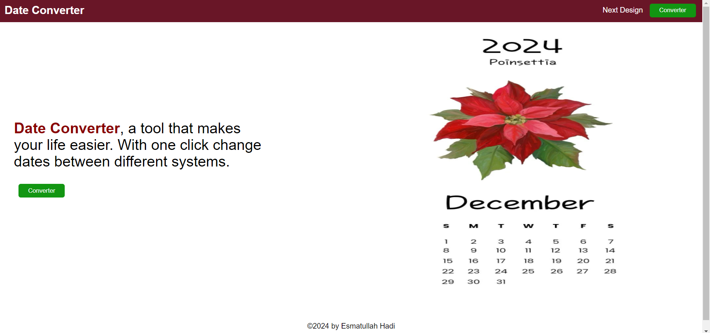
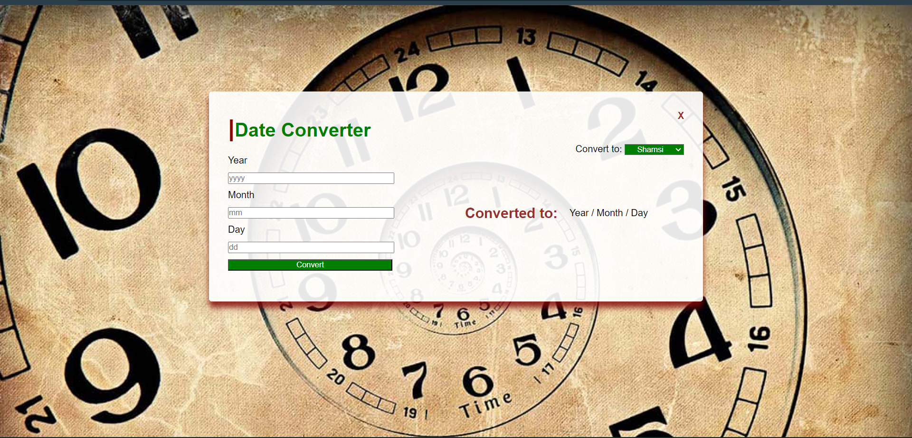

# 🌸 Date Converter 🌸

A sleek and intuitive web application that converts dates between the **Shamsi (Jalaali)** and **Gregorian** calendars. With a clean interface and real-time functionality, users can seamlessly switch between these two calendar systems with ease.



---

## ✨ Features

- 🔄 **Dual Conversion**: Convert dates from Shamsi to Gregorian and vice versa.
- 🖥️ **Responsive Design**: Optimized for desktop, tablet, and mobile use.
- ✅ **Input Validation**: Ensures only valid date entries are processed.
- ⚡ **Real-time Conversion**: Instant display of converted dates.
  


---

## 🎯 How to Use

1. **Choose the Conversion Type**: Select either **Shamsi** to **Gregorian** or vice versa from the dropdown.
2. **Enter the Date**: Input the **Year**, **Month**, and **Day** into the respective fields.
3. **Convert**: Click the "Convert" button to display the converted date below.

---

## 🛠️ Technologies Used

- **HTML5**: For page structure and layout.
- **CSS3**: For styling and responsive design.
- **JavaScript**: Handles the conversion logic and form validation.
- **[Jalaali-JS](https://www.npmjs.com/package/jalaali-js)**: A powerful library for Shamsi-Gregorian date conversion.

---

## 🚀 Getting Started

To run the project locally:

1. **Clone the repository**:
   ```bash
   git clone https://github.com/your-username/date-converter.git
   ```
2. **Open the application**: Simply open `index.html` in your browser to start converting dates.

---

## 🌱 Future Enhancements

- 🌍 Multi-language Support: To accommodate a broader, global audience.
- 🗓️ Date Picker Integration: For more intuitive date selection.
- 🕒 Time Zone Conversion: Extend functionality to handle time zones.
- 💾 Save History: Option to save and download conversion history.

---

## 🤝 Contributing
Contributions and feedback are always welcome! If you find a bug or have a feature request, please open an issue or submit a pull request.

1. Fork the repository.
2. Create a new branch.
3. Make your changes and submit a pull request.

---

## 📄 License

This project is licensed under the MIT License. 

---

Thank you for using Date Converter! 🌟

Feel free to connect or reach out with any feedback or suggestions.


   
